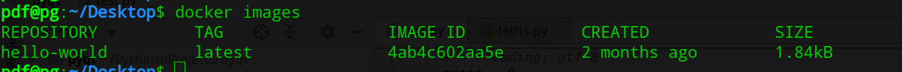
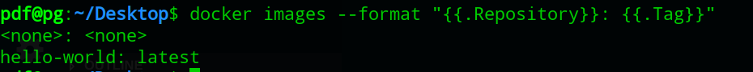
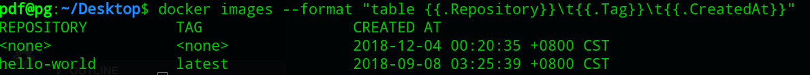

# docker images 查看命令
1. docker镜像表示：
```shell
Remote-dockerhub.com/namespace/bar:latest
# Remote-dockerhub.com:存储镜像的地址，不写默认是docker官方镜像库
# namespace:命名空间，一个用户或者组织的所有镜像的集合
# bar: 仓库，一个仓库有多个镜像，通过laster区分一个镜像
# laster: 镜像的标签
# Layer: 镜像的层
# image id: 镜像的最上层
```

2. 列出本机的所有镜像 `docker images`
```shell
# REPOSITORY: 仓库名
# TAG       : 标签
# IMAGE ID  : 镜像ID，唯一区分镜像
# CREATED   : 创建时间
# SIZE      : 镜像大小
```


3. `docker images [options] [REPOSSITORY[:TAG]]` 详解
```
options 说明：
  -a: 列出本地所有的镜像(包含中间映像层，默认过滤掉中间映像层)
  --digests: 显示镜像的摘要信息
  -f 显示满足条件的镜像
  --format: 指定返回值的模板文件
  --no-trunc: 显示完整的镜像信息
  -q: 只显示镜像ID
```

4. 列出本机REPOSITORY为Ubuntu的镜像：`docker images Ubuntu`

5. `docker images -f `
- 列出所有的悬挂镜像: `docker images -f dangling=true` (悬挂镜像没有`REPOSITORY`和`TAG`)

- 查看某个TAG之后或者之前的镜像: `docker images -f since|before=mongo:3.2.2`

- 构建时指定了Label，通过Label过滤: `docker images -f label=com.example.version=0.1`

- 指定reference: `docker images -f reference=busy*:*libc`

- `-f` 和 `--filter=` 等价

6. `docker images --format`


| Placeholder | Description |
| :---------: | :----------:|
|    `.ID`    |   Image ID  |
|`.Repository`| image repository|
|   `.Tag`    | image tag   |
|  `.Digest`  | image Digest(完整id)|
|`CreatedSince`| 创建镜像后经过的时间 |
|`CreatedAt`  | 创建镜像的时间 |
|`.Size`     | 镜像大小|

```shell
# 使用方式
docker images --format "{{.Repository}}: {{.Tag}}"
```
运行效果图:


7. 以表格形式格式化输出
```shell
docker images --format "table {{.Repository}}\t{{.Tag}}\t{{.CreatedAt}}"
```


8. 删除镜像: `docker rmi xx` (xx可以是id、名称)

9. 