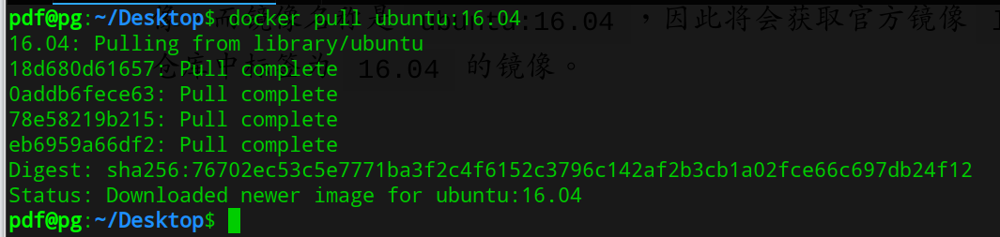
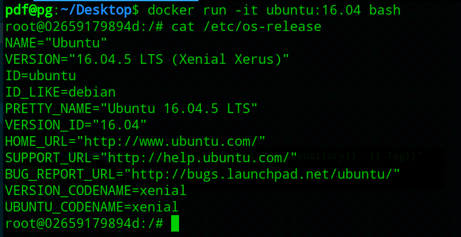
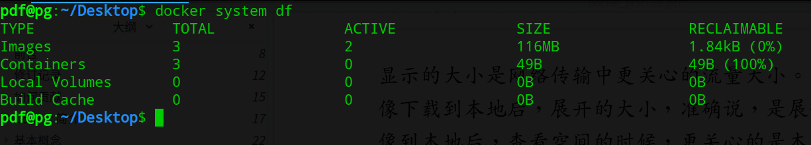

# 使用 `docker` 镜像

## 1、 获取镜像

从 [Docker hub](https://hub.docker.com/explore/) 或者镜像仓库获取镜像可以使用 `docker pull` 命令，命令格式:
```shell
docker pull [选项] [Docker Registry 地址[:port]/]仓库名[:标签]

Options:
  -a, --all-tags              下载所有标签的镜像
      --disable-content-trust 忽略镜像校验，默认为true
```

比如：


下载是一层一层下载的，最后下载完了给出完整的sha256。

### 运行

有了镜像之后，我们可以以镜像为基础，启动并运行一个容器，比如：


- -it : 这是两个参数，-i: 交互式操作，-t:终端
- bash： 放在镜像后面的是需要执行的命令

## 列出镜像

要列出镜像，可以使用 `docker image ls`, 返回之包含了仓库名(REPOSITORY)、标签(TAG)、镜像ID(IMAGE ID)、创建时间(CREATED)、占用空间(SIZE)

### 镜像体积
可以发现使用 docker image ls 返回的Size和Docker Hub上的不一致，因为Docker Hub上的被压缩了。

可以使用 `docker system df` 镜像、容器、数据卷占用大小：


### 虚悬镜像(`dangling image`)
虚悬镜像是一种特殊的镜像，没有仓库名也没有标签，均为`<none>`:
- `docker pull` 可能产生虚悬镜像，一开始下载一个镜像标签为3.2，随着官方维护，发布新的版本，重新pull 3.2的时候，镜像名被转移到了新下载的镜像中，从而成为了`<none>`

- `docker build` 和 `docker commit` 同样可能产生虚悬镜像

可以使用下面的命令找出所有的虚悬镜像:
```shell
docker image ls -f dangling=true
```

由于虚悬镜像完全没有用，可以使用下面的命令删除:
```shell
docker image prune
```

### 中间层镜像
使用下面命令可以看到很多没有标签的镜像:
```shell
docker image ls -a
```

这是因为Docker加速镜像构建，重复利用资源所利用的中间层镜像，这些是不能被删除的，因为这些是被上层依赖的

