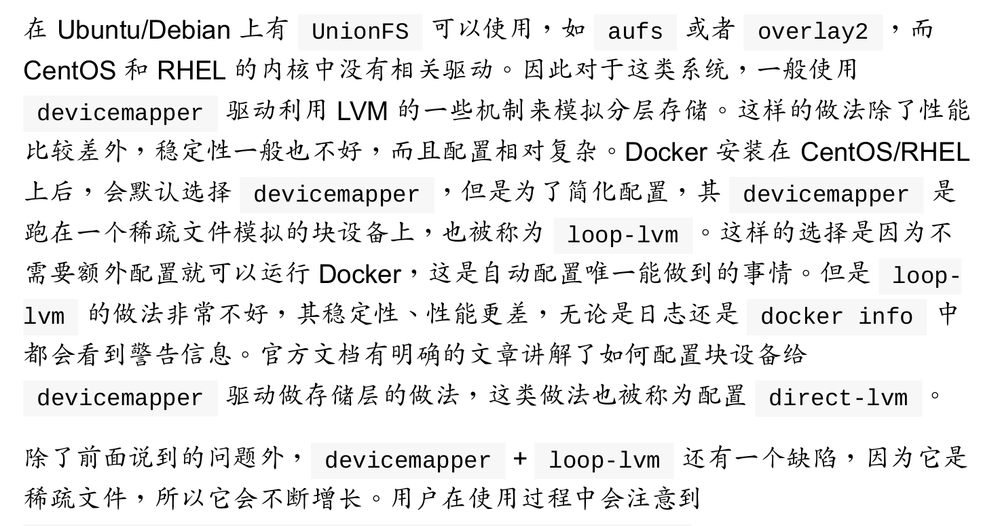
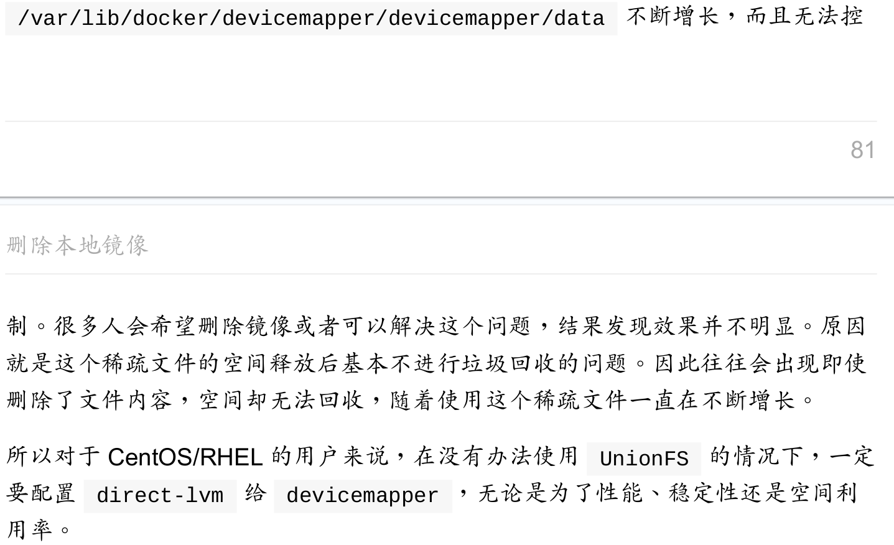

### 删除本地镜像
命令格式:
```shell
docker image rm [选项] <镜像1> [<镜像2> ...]
# OR
docker rmi [选项] <镜像1> [<镜像2> ...]
```

其中，`<镜像>`可以是`镜像短ID`、`镜像长ID`、`镜像名`或者`镜像摘要`。

- `Untagged`: 镜像可以有多个标签，有时候删除可能只是取消了这个标签，或者是还有别的镜像依赖要删除镜像的某些层，此时删除时显示`Untagged`.
- `Deleted`: 当镜像完全被删除时显示。

可以利用`docker image ls -q` (列出镜像id)配合批量删除:
```shell
# 删除仓库名为redis的所有镜像
docker image rm $(docker image ls -q redis)

# 删除在mongo:3.2的所有镜像
docker image rm $(docker image ls -q -f before=mongo:3.2)
```

### ！！！注意



