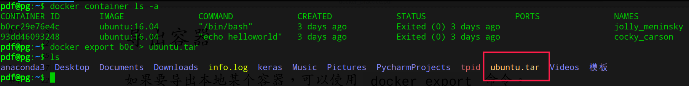
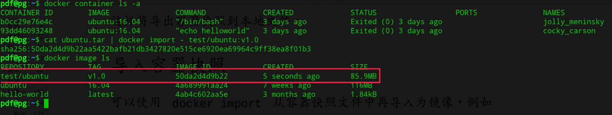

## 导出容器

导出某个本地的容器，可以使用`docker export`命令:


这样就可以导出容器快照到本地文件

##  导入容器快照

可以使用`docker import `从容器快照中再导入为镜像，例如：



也可以指定某个目录或者URL导入：
```shell
docker import http://example.com/exampleimage.tgz example/imag
erepo
```

注意：

  - `docker load`: 导入镜像存储文件到本地镜像库
  - `docker import`： 导入容器快照到本地镜像库
  - 两者的区别是容器快照将会所有的历史记录和元数据信息，镜像文件保存完整记录。从容器快照导入可以重新指定标签等元数据信息。

## 删除容器

可以使用 `docker container rm <container>` 来删除一个停止的容器，如果要删除一个运行中的容器可以加上 `-f` 参数，Docker会发送 `SIGKILL` 信号给容器。

如果要清除所有已经停止的容器，可以使用：
```shell
docker container prune
```